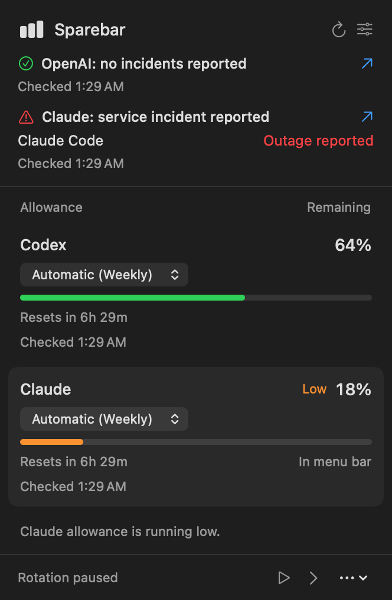
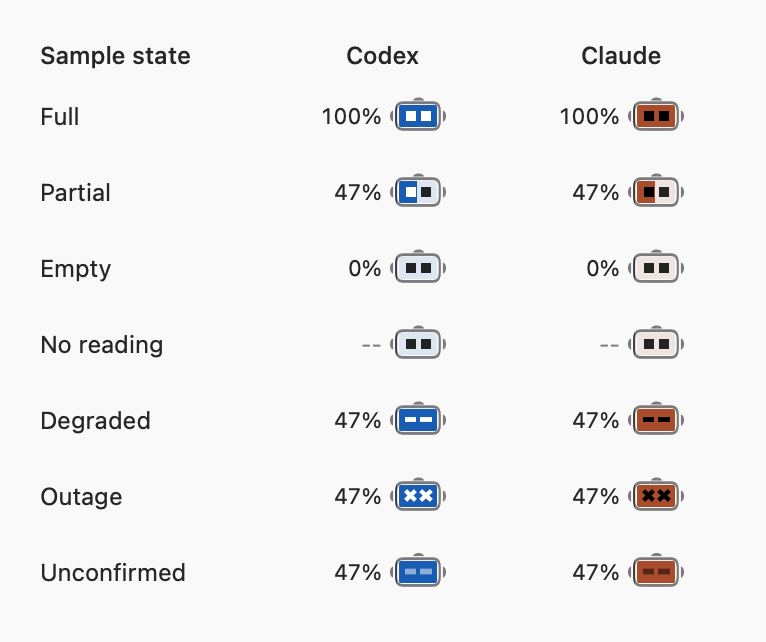
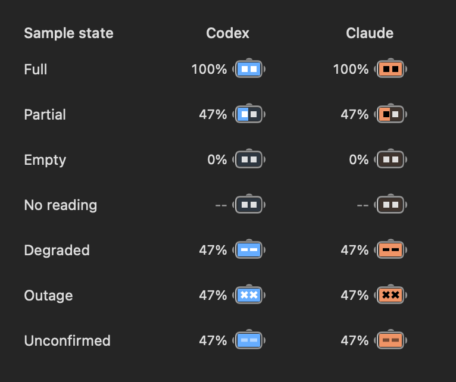
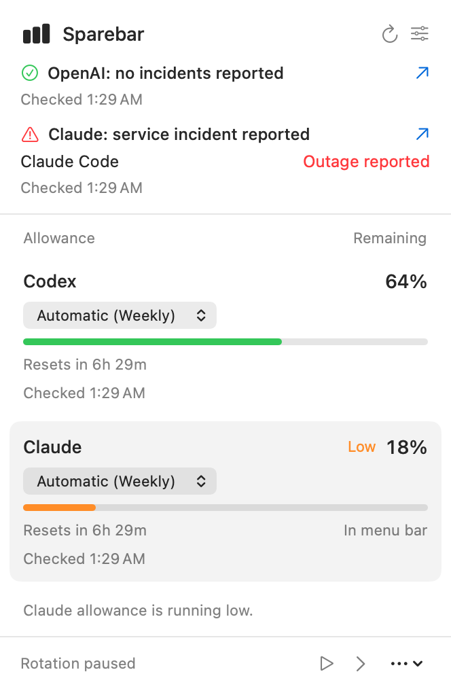
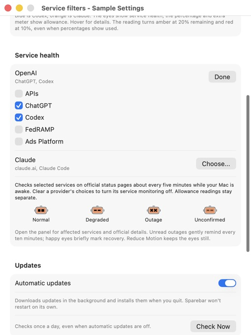
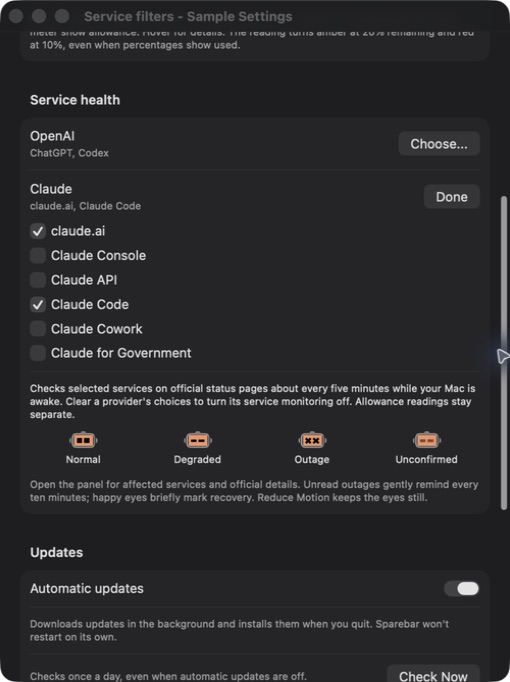

# Sparebar

See what's left in Codex and Claude Code, and whether their providers report service problems. One rotating macOS menu-bar slot keeps allowances and service health in view.



Native view with synthetic service reports and sample allowances.

## Try it

**[Download Sparebar for Apple silicon](https://github.com/frrrredo/sparebar/releases)** - signed and notarized, early preview.

Choose the DMG from the newest release, open it, drag Sparebar into Applications, then open Sparebar.

Requires Apple silicon, macOS 26.5.1 or newer, and a signed-in [Codex CLI](https://learn.chatgpt.com/docs/cli) or [Claude Code](https://code.claude.com/docs/en/setup) subscription account.

First launch opens your allowances directly. Missing tools get a setup link. **Launch at login** is optional in Settings.

<details>
<summary>Build from source</summary>

Requires Xcode.

```sh
git clone https://github.com/frrrredo/sparebar.git
cd sparebar
./scripts/package-app.sh
open dist/Sparebar.app
```

</details>

## Small by design

- Rotates between tools; opening the panel pauses it.
- Weekly, session, and model allowances when available.
- Percentage beside a compact battery-shaped robot. Blue identifies Codex; orange identifies Claude. During normal service, its fill follows the displayed allowance and drains from right to left. The eyes remain readable in the empty area. Only the robot slides during rotation; digits update in place. Hover for the tool name and reported service status.
- Remaining by default, used if you prefer. Readings turn amber at 20% left and red at 10%; the tool's color stays fixed. Missing readings show `--`.
- **Show Percentage** is on by default. Turn it off in the panel's **More options** menu or Settings to hide the number; the preference is saved.
- Checks for updates once a day. **Automatic updates** is on by default: new versions download in the background and install when you quit. Sparebar never restarts itself unexpectedly.
- An orange dot marks an available update. Open the panel for a short "What's new" message, full notes behind the info button, and **Update and Restart** (or **Restart to Update** when ready). Turn automatic updates off to choose each download; daily checks continue.

If a crowded menu bar hides Sparebar (for example, during a video call), open it from Applications or Spotlight to see your allowances in a window. For the narrowest display, turn off **Show Percentage** and set **Extra meter** to **None** in Settings. When visible, hold Command and drag Sparebar nearer the clock to give it priority over items to its left. macOS can still hide items when space runs out.

Your official CLIs handle sign-in. Sparebar sends no model prompts, stores no provider credentials or usage history, and has no analytics. [Sparkle](https://sparkle-project.org/) is bundled for updates; checks contact GitHub without sending provider readings or a system profile. [How reads work](docs/providers.md).

Versions through 0.1.2 need one manual installation of an updater-enabled release. Subsequent releases can update in place. Updates must be published before they can be discovered.

Claude's usage control is experimental and can return cached readings. Tested with Codex 0.153.4 and Claude Code 2.1.263. Older macOS and Intel support can follow demand.

## Service health

Keep an eye on your allowance and the services behind it.

Service health is included from version 0.1.4. Sparebar reads public service reports for OpenAI and Claude about every five minutes while your Mac is awake. Its eyes show normal service, degradation, an outage, or unconfirmed status. During normal service, the battery fill represents the displayed allowance. Degraded, outage, and unconfirmed states keep a full face so their eye shapes stay clear; percentage and optional meters continue to show allowance.

Native battery states with sample data:

<p>
  
  
</p>

Open the panel to see which service is affected and follow the official status link for details. A gentle pulse marks a new incident, with ten-minute outage reminders until you open the panel. Happy eyes briefly mark recovery. Reduce Motion keeps the eyes still. These public status checks require no extra account or API key.

From version 0.1.5, **Settings > Service health > Choose...** lets you select services independently for OpenAI and Claude. ChatGPT, Codex, claude.ai, and Claude Code start enabled; APIs, developer consoles, government services, Claude Cowork, and Ads Platform start off. Your choices are saved. Only selected services affect the eyes and panel, so an unrelated government or API incident stays out of your way.

Clear all choices for a provider to stop its service checks. Allowance readings continue independently. Changing the selection uses the last report immediately, without an extra request or a recovery celebration. Reports that do not identify the affected services clearly remain unconfirmed.

| Eyes | Meaning |
| --- | --- |
| Squares | No incidents reported for selected services. |
| Thin lines | Degraded service or maintenance reported. |
| Crosses | An outage is reported for at least one selected service. |
| Muted lines | Service status could not be confirmed. |

**Settings > Service health** keeps this explanation close at hand. Provider reports describe shared services; they do not replace your allowance reading or diagnose your Mac's connection.

[Read how service reports work](docs/providers.md#service-status).

Native preview with synthetic service reports and sample allowances:

<p>
  
  
</p>

The service choices and eye-shape guide inside Settings (sample data):

<p>
  
  
</p>

## Contribute

[Bugs and ideas](https://github.com/frrrredo/sparebar/issues) are welcome. [CONTRIBUTING.md](CONTRIBUTING.md) covers setup, tests, and small pull requests. Keep the app simple.

Personal project by [frrrredo](https://github.com/frrrredo). Independent of OpenAI and Anthropic. [Apache-2.0](LICENSE).
