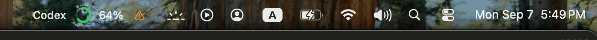
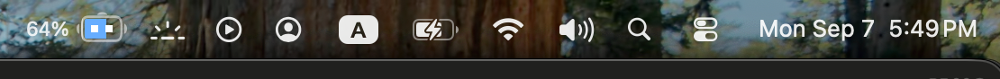
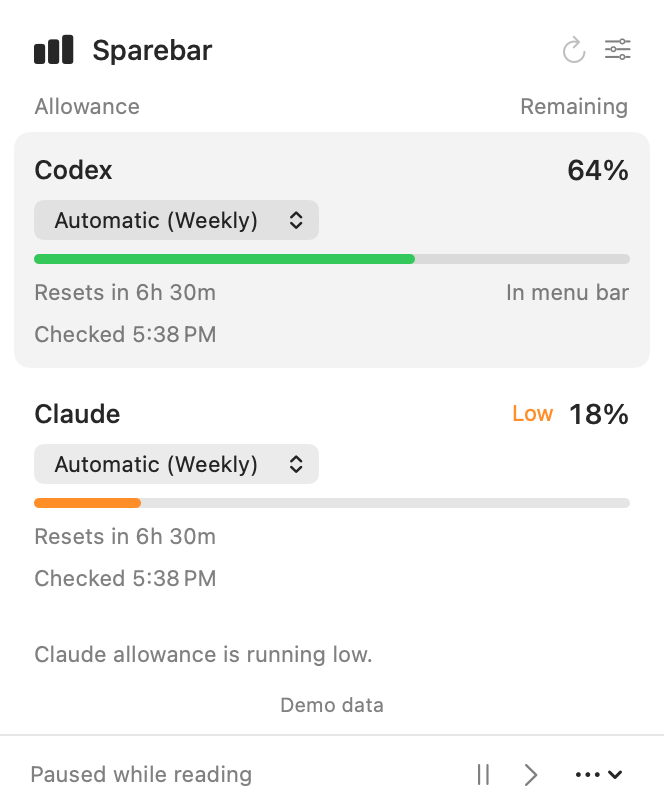
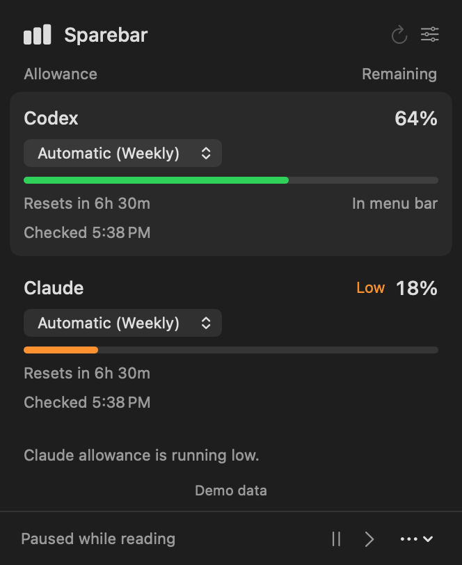
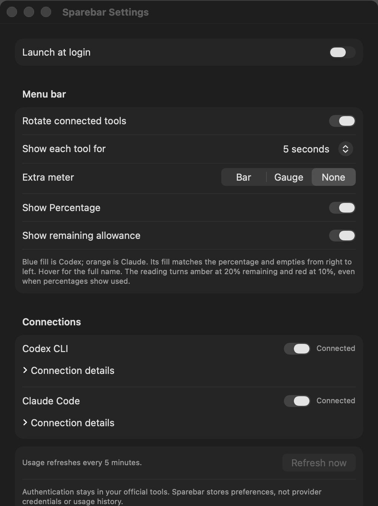

# Sparebar

See what's left in Codex and Claude Code without opening either tool. One rotating macOS menu-bar slot keeps both allowances in view without taking over your menu bar.



Native animation, sample allowances. Rotates every five seconds.

## Try it

**[Download Sparebar for Apple silicon](https://github.com/frrrredo/sparebar/releases/download/v0.1.1/Sparebar-0.1.1-arm64.dmg)** - signed and notarized, early preview.

Open the DMG, drag Sparebar into Applications, then open it.

Requires Apple silicon, macOS 26.5.1 or newer, and a signed-in [Codex CLI](https://learn.chatgpt.com/docs/cli) or [Claude Code](https://code.claude.com/docs/en/setup) subscription account.

First launch opens your allowances directly. Missing tools get a setup link. **Launch at login** is optional in Settings.

<details>
<summary>Build from source</summary>

Requires Xcode.

```sh
git clone https://github.com/frrrredo/sparebar.git
cd sparebar
./scripts/package-app.sh
open dist/Sparebar.app
```

</details>

## Small by design

- Rotates between tools; opening the panel pauses it.
- Weekly, session, and model allowances when available.
- Bar, gauge, or percentage; remaining by default, used if you prefer.
- Amber at 20% left, red at 10%. Missing readings show `--`.

Your official CLIs handle sign-in. Sparebar sends no model prompts, stores no credentials or usage history, and has no analytics or third-party package dependencies. [How reads work](docs/providers.md).

Claude's usage control is experimental and can return cached readings. Tested with Codex 0.153.4 and Claude Code 2.1.263. Older macOS and Intel support can follow demand.

## Screenshots

Menu bar, still:



Light and dark allowance panels. Native views, sample data, exported at 2x resolution.

<p>
  
  
</p>

Settings: optional launch at login, rotation, meter style, and connections.



## Contribute

[Bugs and ideas](https://github.com/frrrredo/sparebar/issues) are welcome. [CONTRIBUTING.md](CONTRIBUTING.md) covers setup, tests, and small pull requests. Keep the app simple.

Personal project by [frrrredo](https://github.com/frrrredo). Independent of OpenAI and Anthropic. [Apache-2.0](LICENSE).
